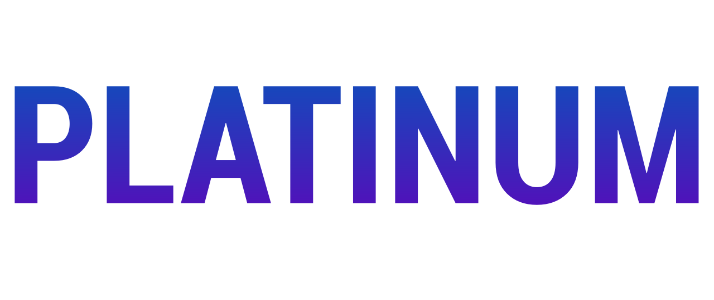

<b>Repositorio recopilatorio para el proyecto Platinum</b> Proyecto Intermodular del Grado Superior de Desarrollo de Aplicaciones Web

# Platinum

Platinum es una aplicación web de tipo SPA. El objetivo de esta aplicación es el de crear un plataforma dónde puedas, a través de la vinculación de tu cuenta de Steam, obtener estadísticas de tus juegos y logros obtenidos en estos, comparar tus juegos y logros con los de tus amigos, participar en clasificaciones y retos y participar en los foros dónde se discuten temas relacionados con los videojuegos y guias para obtener logros específicos.

# Recursos

Para más información sobre el desarrollo y estudio de este proyecto, se recomienda consultar los recursos disponibles en la carpeta **/docs** de este repositorio, dónde se encuentran los documentos de planificación, diseño y desarrollo del proyecto.

> [!NOTE]
> Documentación disponible en: [/docs/README.md](./docs/README.md).

# Memoria del proyecto

En la memoria del proyecto es un documento detallado que explica el proceso de desarrollo del proyecto, incluyendo la planificación, diseño, implementación y resultados obtenidos. Este documento es una parte fundamental del proyecto, ya que permite comprender el proceso de desarrollo y los resultados obtenidos, así como las decisiones tomadas durante el desarrollo del proyecto. Se recomienda consultar la memoria del proyecto para obtener una visión completa del desarrollo del proyecto y los resultados obtenidos.

Es importante tener en cuenta que la memoria del proyecto es el conjunto de todo el estudio y planificación previa al desarrollo del proyecto, por tanto, se puede encontrar más información que la disponible en los recursos proporcionados en la carpeta **/docs**.

> [!NOTE]
> Memoria disponible en: [/memoria.pdf](./memoria.pdf).

# Demo

Para acceder a la demo de la aplicación, puedes seguir las instrucciones disponibles en **/demo**. En esta carpeta se encuentra toda la documentación necesaria para ejecutar de una demo en tu máquina local, incluyendo los pasos para la instalación de dependencias, ejecución del servidor de desarrollo y construcción del proyecto para producción.

> [!IMPORTANT]
> Es **importante** leer la documentación en [/demo/README.md](./demo/README.md) antes de ejecutar el proyecto.

> [!NOTE]
> Para acceder al repositorio específico de la demo, dónde se encuentra toda la información detallada del código y desarrollo, puedes acceder a: [Platinum](https://github.com/Kiro85/entregables-projecte-final-dawpi2526_platinum_src).

<small>La documentación del presente repositorio, incluyendo todos los archivos de extensión <i>.md</i> se distribuyen bajo <b>CC BY 4.0</b>. El codigo fuente encontrado dentro de la carpeta <i>/src</i> se distribuye bajo la licencia del repositorio <b>MIT License</b>.</small>
