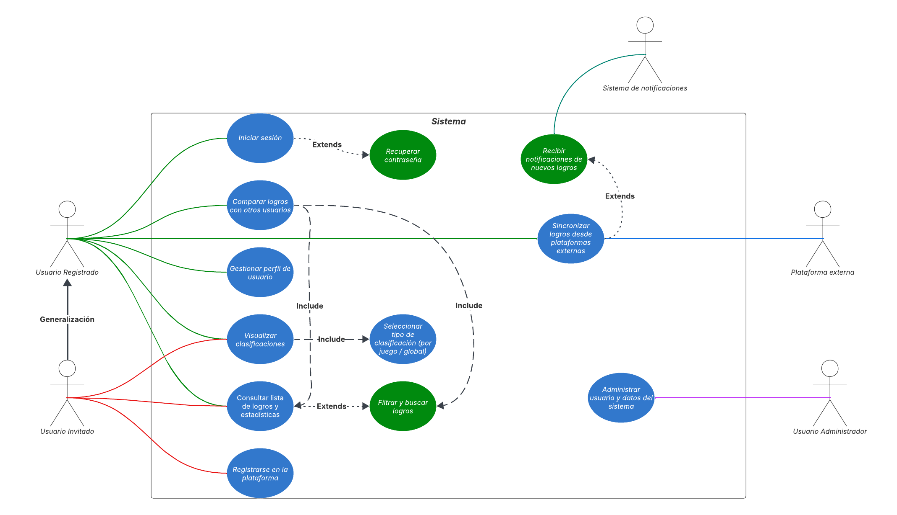
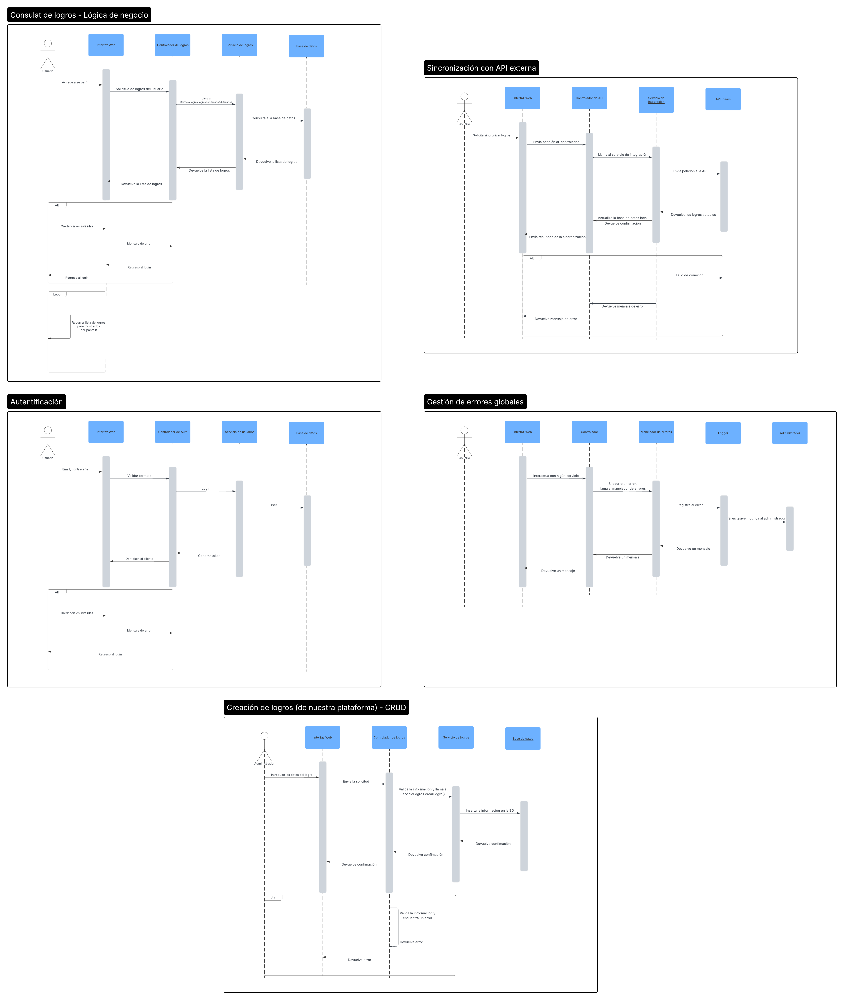
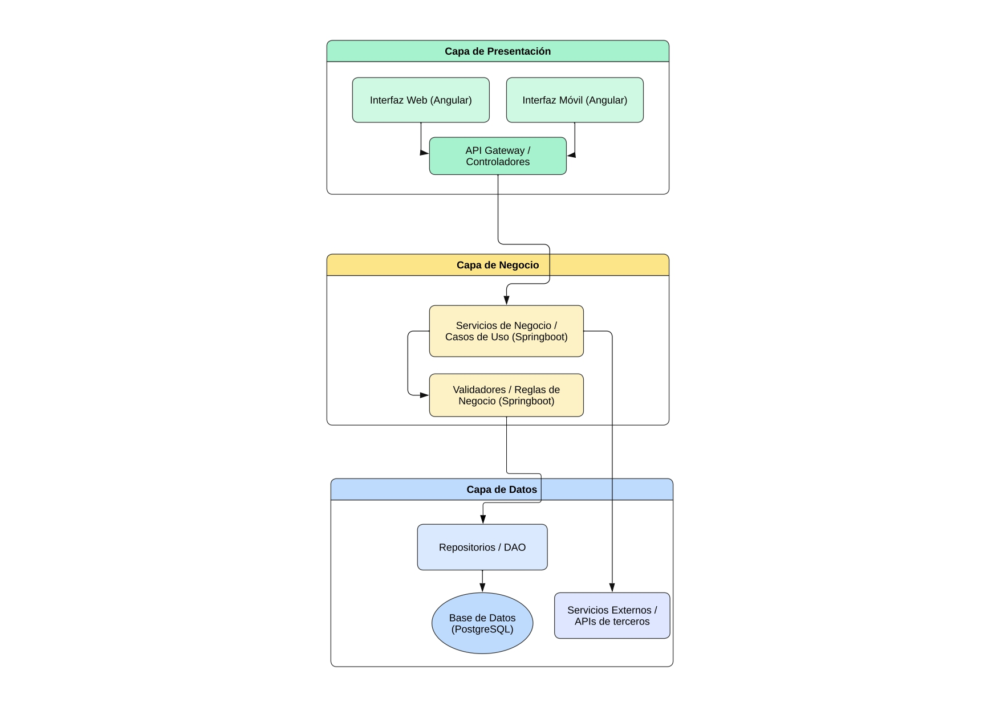

# 1. Ámbito y limitaciones

En este punto se define tanto el ámbito del proyecto, especificando las funcionalidades y elementos que forman parte del mismo, como las limitaciones que se pueden encontrar durante su desarrollo.

## 1.01. Ámbito

El ámbito principal de la aplicación es la de proporcionar una plataforma centralizada para la gestión y visualización de los logros de Steam de los usuarios, permitiéndoles observar sus logros y los de otros usuarios así como entablar conversaciones sobre los logros que quieran.

La aplicación permitirá:

- Interactuar con un portal web dinámico y responsivo.
- Crear un perfil de usuario básico, donde se pueda interactuar con la web.
- Enlazar una cuenta de Steam existente a un perfil para vincular logros.
- Observar tablas de clasificación globales en relación a los logros de otros usuarios y de otros juegos.
- Observar datos sobre juegos.
- Observar perfiles de usuarios.
- Crear e interactuar con publicaciones en relación a ciertos logros.

## 1.02. Limitaciones

Lamentablemente, debido al posible tamaño de la aplicación se aplican ciertas limitaciones:

- No se trabajará en formato móvil.
- Solo se contemplarán los logros de la página de Steam.
- No se implementarán sistemas de autenticación (2FA).
- Mensajería privada e instantánea.
- Sistemas de economía.
- Colaboraciones externas o marketplace.

# 2. Requerimientos funcionales y no funcionales

El siguiente apartado define todos los principales requisitos funcionales y no funcionales que presentará la aplicación.

## 2.01. Requerimientos funcionales

| Prioridad                                                                                                                 | Requisito funcional             | Descripción                                                                     |
| ------------------------------------------------------------------------------------------------------------------------- | ------------------------------- | ------------------------------------------------------------------------------- |
| <strong>Must</strong>   | Registro e inicio de sesión     | Permitir crear cuentas y autenticarse                                           |
| <strong>Must</strong>   | Integración con la API de Steam | Integrar de forma funcional la API pública de Steam para obtener información    |
| <strong>Must</strong>   | Visualización de logros         | Permitir mostrar los logros de usuarios aplicando filtros                       |
| <strong>Must</strong>   | Sistema de recompensas          | Abonar “puntos” o “badges” al completar retos de la aplicación                  |
| <strong>Must</strong>   | Foros comunitarios              | Permitir publicar e interactuar con foros públicos                              |
| <strong>Should</strong> | Panel de administración         | Permitir la gestión de usuarios y contenido                                     |
| <strong>Should</strong> | Clasificaciones                 | Otorgar un panel de clasificaciones por juegos, regiones y global de los logros |
| <strong>Should</strong> | Retos                           | Implementar retos periódicos para la obtención de “puntos”                      |
| <strong>Should</strong> | Sistema de suscripción          | Permitir el acceso a funciones avanzadas mediante una suscripción               |
| <strong>Could</strong>  | Notificaciones                  | Implementar un sistema de notificaciones en la plataforma y/o email             |
| <strong>Won’t</strong>  | Aplicación móvil nativa         | No existirá una aplicación para móviles                                         |

## 2.02. Requerimientos no funcionales

| Requisito no funcional | Descripción                                                                                          |
| ---------------------- | ---------------------------------------------------------------------------------------------------- |
| **Usabilidad**         | Interfaz intuitiva y coherente con la estética de Steam y familiar con el entorno de los videojuegos |
| **Rendimiento**        | Carga inferior a 3 segundos en conexiones                                                            |
| **Seguridad**          | Cifrado de contraseñas y comunicación HTTPS                                                          |
| **Compatibilidad**     | Soporte para navegadores modernos                                                                    |
| **Escalabilidad**      | Arquitectura modular para futuras mejoras                                                            |
| **Disponibilidad**     | Mínimo 99% de disponibilidad de los servidores en producción                                         |
| **Mantenibilidad**     | Código limpio, comentado y versionado (Git)                                                          |
| **Accesibilidad**      | Página accesible a la mayor cantidad de usuarios                                                     |
| **Privacidad**         | Cumplimiento del RGPD                                                                                |
| **Publicidad ética**   | Anuncios limitados, no invasivos y relacionados con la temática de la página                         |

# 3. Apartados técnicos

En el siguiente punto se detallan los apartados del desarrollo de forma general pero aportando un punto de vista técnico para describir cómo tomará forma el proyecto.

## 3.01. Entorno de trabajo

Se trabajara en equipo, mediante las herramientas aprendidas durante el curso para la organización y edición del código cómo Visual studio, Git y Github, IntelliJ…

El trabajo, desde un punto de vista de Git, se dividirá en “branches” individuales donde cada integrante trabajara en sus funciones establecidas. Todos los cambios se aplicarán, más adelante, sobre la rama main.

## 3.02. Metodología de trabajo

Las tareas principales se tomarán como una guía sobre la que se irá construyendo la aplicación. En otras palabras, la aplicación se irá construyendo de forma progresiva, repartiendo las tareas entre los integrantes del grupo. Una vez que dichas tareas estén completadas y en un estado funcional se revisarán las guías proporcionadas para revisar qué funciones están implementadas y cuales podrían implementarse.

## 3.03. Persistencia de datos

Para trabajar con los datos que requieran persistencia se hará uso de una base de datos PostgreSQL. Se guardarán datos de usuario, publicaciones de la plataforma y datos en caché, entre otras.
Los datos que deban ser adquiridos de la API de steam se irán recopilando de forma periódica y controlada para evitar saturar la API.

## 3.04. Seguridad básica

Se implementarán medidas de seguridad básica principalmente manejadas por JWT. Se bloquean rutas dependiendo del tipo de sesión y se implementarán medidas para evitar inyecciones de SQL.

## 3.05. Mantenibilidad y escalabilidad

Aprovechando la arquitectura “modular” que ofrece tanto springboot como angular la aplicación, en ambos entornos de front end y back end, se desarrollará de forma modular para mejorar la mantenibilidad y escalabilidad.

Se implementarán decisiones de diseño, como uso limitado de librerías externas, código reutilizable y sintaxis definida para mejorar la legibilidad y estabilidad del código fuente.

# 4. Arquitectura

Se aplicará una arquitectura cliente-servidor para la aplicación, separando de forma definida el frontend y backend haciendo uso de DTO y comunicación HTTP. La comunicación se hará mediante peticiones y respuestas de API Rest.

## 4.01. Apartado Cliente

El cliente, angular, será el encargado de realizar peticiones API Rest al servidor, manejar errores y estados HTTP enviados por el servidor, mostrar la interfaz de usuario. Todo esto haciendo uso de CSS personalizado en conjunto a Tailwind CSS.

## 4.02. Apartado Servidor

El servidor, en este caso springboot, será el encargado de recibir las peticiones, controlar la lógica de negocio, construir DTO y conectar y manejar los datos de la base de datos.

## 4.03. Apartado General

Se hará uso de las arquitecturas modulares de angular y springboot para la base de código.

# 5. Tecnologías

Se explicarán las tecnologías usadas separándolas dependiendo del ámbito, front end o back end.

## 5.01. Front End

Se desarrollará la aplicación sobre Angular 20 haciendo uso del framework de css Tailwind v5.

## 5.02. Back End

El backend estará construido en Java sobre el framework de springboot, haciendo uso de dependencias adicionales pensadas para el desarrollo web. También se implementará un

# 6. Diagramas UML

Aquí se incluyen todos los diagramas UML realizados.

## 6.01. Diagrama de casos de uso

## 6.02. Diagrama de secuencia

## 6.03. Diagrama de arquitectura

## 6.04. Diagrama de ER

# 7. Principales riesgos

Uno de los riesgos más presentes es la baja visibilidad al inicio, ya que al ser nuevo, harán falta esfuerzos adicionales para darlo a conocer y que comience a ganar popularidad y usuarios.

Ligado a este problema, encontramos la existencia de una competencia claramente establecida, que provocará más dificultad para que la web destaque.

En el caso de que estos dos problemas perduren más de lo previsto y la web dejara de ser rentable, se dificultarían los costes de mantenibilidad.

# 8. Nivel de desarrollo predecido

Se va a desarrollar una version minimalista de la aplicacion, incluyendo endpoints propios, una interfaz funcional e integración con la API de Steam.
